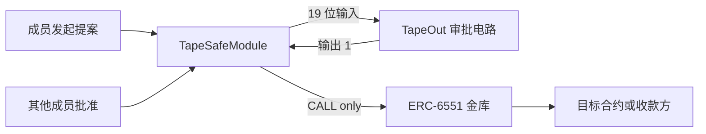

# TapeSafe｜可验证团队审批电路

Verifiable approval policies on TapeOut · X Layer.


TapeSafe 将团队审批规则编译为真实的 TapeOut NAND 电路：支持最多五名成员、有效票数门槛、发起人不计票、必签成员和紧急冻结。浏览器实验室执行同一份网表，链上核验页面读取 X Layer 主网电路结果。

**当前版本：0.5.0。处理器和审批电路已部署；金库执行器与金库尚未部署。** 电路求值只返回审批判断，不执行转账。执行器扩展有源码与测试记录，见下方架构。

## 演示

[](https://kin684660-commits.github.io/TapeSafe/)

[播放 28 秒中文演示](https://kin684660-commits.github.io/TapeSafe/) · [下载 1080p MP4](https://kin684660-commits.github.io/TapeSafe/demo/TapeSafe-Demo-ZH-28s-1080p.mp4) · [可编辑视频工程](demo-video/README.md)

视频使用真实界面截图剪辑，展示两票通过、自批无效、紧急冻结，以及主网双 RPC 只读核验。中文合成旁白与原创配乐的来源记录保存在视频工程中。

## X Layer 主网

| 项目 | 部署信息 |
| --- | --- |
| 网络 | X Layer Mainnet，Chain ID 196 |
| Processor / Transistors | `0x7e33ea21cc11929b48b339735a61c2d4b8aed708` |
| Circuits | `0xe10931e0cfb42c76ced25b4712e7553f24a3d9e9` |
| CPU index / Circuit ID | **267 / 1** |
| 部署钱包 / NFT owner | `0x375abb0e951addda5538e38ac5bcfce814a14752` |
| 发行上限 / 单价 | 210,000 / 0.000066 OKB，协议费与 Gas 另付 |
| 电路规格 | 19 输入 / 1 输出 / 74 NAND / 0 LATCH / 518 字节 |

[创建交易](https://www.oklink.com/xlayer/tx/0x12431ca0427bf2e21bd69a3baf0396d5ab4f450caf4a45addcd3c5169b5d63df) · [铸造交易](https://www.oklink.com/xlayer/tx/0x84b299e7e65fadd1a5de331e8bc974ce54f45c6ee0f1aa53e83f737254eb755a) · [流片交易](https://www.oklink.com/xlayer/tx/0x92300b764d3c9c5c6ab1632cbdc242183f808ce606e5f8063d942ad9a8077f7a)

[部署与交易清单](docs/MAINNET.md) · [链上核验记录](docs/chain-evidence.json) · [电路规格](docs/CIRCUIT.md) · [测试记录](docs/QA.md)

## 本地运行

需要 Node.js；合约测试需要 Foundry。

```sh
npm test
npm run test:hardware
npm run preview
```

预览地址：`http://127.0.0.1:8765`。也可以在 `tapesafe_web` 目录运行 `node serve.mjs`。

- **电路实验室**：切换审批场景，调整成员状态，执行真实 518 字节网表并查看 NAND 信号。
- **链上核验**：无需钱包，通过两个独立 RPC 在同一区块读取工厂登记、电路规格、NFT 持有人和四组求值结果。
- **部署助手**：准备并模拟创建、铸造和流片交易；只有钱包签名后才发送交易。

```sh
cd tapesafe_contracts
forge test
forge test --match-contract TapeSafeFork --fork-url https://xlayerrpc.okx.com -vv
```

分叉测试仅在本地执行，不广播主网交易。测试范围与历史运行环境见 [QA.md](docs/QA.md)。

## 链上核验

```sh
node scripts/verify-chain.mjs --tapeout-tx 0x92300b764d3c9c5c6ab1632cbdc242183f808ce606e5f8063d942ad9a8077f7a
```

核验脚本比较双 RPC 区块信息、处理器登记、创建事件配对、交易输入、铸造单价、流片网表字节、Circuit ID 和四组 eval 结果。本地穷举覆盖全部 524,288 组输入；链上代表向量与完整真值表测试分别提供证据。

## 执行器扩展



该架构的执行器与金库尚未部署。执行器实现提案哈希绑定、有效期、配置版本、状态检查、NFT 托管校验和重复执行保护。冻结使旧提案失效；底层调用失败回滚执行状态。完整扩展的部署要求见 [VAULT-OPTIONAL.md](docs/VAULT-OPTIONAL.md)。

## 开发文档

- [部署与复现](docs/DEPLOYMENT.md)
- [电路输入映射与网表](docs/CIRCUIT.md)
- [钱包部署助手](docs/WALLET-HELPER.md)
- [测试与验证](docs/QA.md)
- [安全边界](docs/SECURITY.md)
- [版本记录](docs/CHANGELOG.md)
- [视觉资源来源](docs/ASSETS.md)

**未审计原型。** 底层 TapeOut 工厂与 beacon 可升级。测试通过不等同于安全审计，不适合存放大额资产。具体信任边界见 [SECURITY.md](docs/SECURITY.md)。

## License

[MIT](LICENSE)
