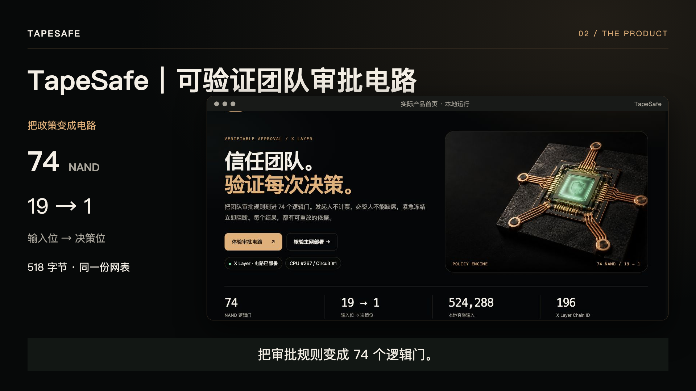
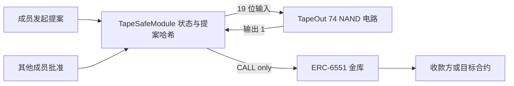

# TapeSafe｜可验证团队审批电路

Verifiable approval policies on TapeOut · X Layer.


**0.5.0 主网电路与产品演示版：处理器和审批电路已部署。** [按此手册逐步操作](docs/SPRINT.md)。金库执行器是已实现、已测试的扩展，本次不部署，不声明真实放款。

**每一笔放款，先过 74 个逻辑门。**

TapeSafe 是 X Layer 上的多签金库原型：审批状态由 Solidity 保存，审批规则由 TapeOut NAND 电路计算。发起人不计票，可设置必签人，签名人可紧急冻结；只有电路输出 1，执行器才调用金库的 CALL 接口。

> **未审计原型。** 本仓库已填写并核对真实处理器和电路地址；执行器和金库不在本次部署范围。离线演示、分叉测试、真实主网部署是三种不同证据。底层 TapeOut 工厂与 beacon 可升级，不适合存放大额资产。

## 28 秒中文演示

[](https://github.com/kin684660-commits/TapeSafe/blob/main/docs/demo/TapeSafe-Demo-ZH-28s-1080p.mp4)

[直接播放中文演示](https://kin684660-commits.github.io/TapeSafe/) · [查看 / 下载 1080p MP4](https://github.com/kin684660-commits/TapeSafe/blob/main/docs/demo/TapeSafe-Demo-ZH-28s-1080p.mp4) · [字幕](docs/demo/TapeSafe-Demo-ZH.srt) · [可编辑 Remotion 工程](demo-video/README.md)

使用实际界面截图演示“两票通过、自批无效、紧急冻结”，并展示双 RPC 读取的真实主网结果。中文旁白与原创配乐，时长约 28 秒。截图剪辑中的实验室是浏览器网表执行，核验台是链上只读调用；执行器与金库本次未部署。

公开视频页：https://kin684660-commits.github.io/TapeSafe/ 。页面提供播放器，仓库 MP4 同时保留为原始交付物。

## X Layer 主网部署

| 项目 | 已核对的部署信息 |
| --- | --- |
| 处理器 / Transistors | `0x7e33ea21cc11929b48b339735a61c2d4b8aed708` |
| 电路合约 / Circuits | `0xe10931e0cfb42c76ced25b4712e7553f24a3d9e9` |
| CPU index / Circuit ID | **267 / 1** |
| 部署钱包 / NFT owner | `0x375abb0e951addda5538e38ac5bcfce814a14752` |
| 发行上限 / 单价 | 210,000 / 0.000066 OKB（协议费与 Gas 另付） |
| 电路规格 | 19 输入 / 1 输出 / 74 NAND / 0 LATCH / 518 字节 |

[创建交易](https://www.oklink.com/xlayer/tx/0x12431ca0427bf2e21bd69a3baf0396d5ab4f450caf4a45addcd3c5169b5d63df) · [铸造交易](https://www.oklink.com/xlayer/tx/0x84b299e7e65fadd1a5de331e8bc974ce54f45c6ee0f1aa53e83f737254eb755a) · [流片交易](https://www.oklink.com/xlayer/tx/0x92300b764d3c9c5c6ab1632cbdc242183f808ce606e5f8063d942ad9a8077f7a)

[链上只读核验记录](docs/chain-evidence.json) · [钱包部署导出](docs/deployment.json)。可复现核验：

```sh
node scripts/verify-chain.mjs --tapeout-tx 0x92300b764d3c9c5c6ab1632cbdc242183f808ce606e5f8063d942ad9a8077f7a
```

核验页提供双 RPC 实时 `eval`，无需连接钱包。28 秒中文演示已制作，视频与工程见下方。三笔部署交易的历史总支出约 0.013474 OKB（含 Gas），不是后续部署的报价。

## 本次提交方式

按项目方确认的交付范围：**GitHub 源码 + 部署到 X Layer 后录制、评委可打开的视频 + 处理器地址与电路证据**。网页部署和 DeWEB 均为可选项。视频在真实部署后录制；本地截图不能代替公开视频或链上证据。

- [提交材料与待填项](docs/SUBMISSION.md)
- [部署与交接步骤](docs/DEPLOYMENT.md)
- [电路规格与字节核对](docs/CIRCUIT.md)
- [部署后视频脚本](docs/DEMO.md)
- [测试结果与限制](docs/QA.md)
- [安全边界](docs/SECURITY.md)

## 五分钟运行

需要 Node.js 22+；合约测试需要 Foundry 和 Solidity 0.8.26。浏览器不依赖 CDN，基础演示无需 npm 安装。

```sh
# 在仓库根目录
npm test                   # 网表一致性、浏览器穷举、ABI 与前端回归
npm run test:hardware       # BLIF 编译后的电路穷举
npm run preview            # http://127.0.0.1:8765
```

也支持原有入口：

```sh
cd tapesafe_web
node serve.mjs
```

首页 → **电路实验室**：切换两票放行、单票拒绝、自批无效、紧急冻结和缺少必签；直接执行上传用的 518 字节网表，不是预置动画。绿色门表示该门输出 1。此页面不会发交易。

```sh
cd tapesafe_contracts
forge test
forge test --match-contract TapeSafeFork --fork-url https://xlayerrpc.okx.com -vv
```

普通 `forge test` 验证本地单元测试，未接入链 196 时跳过分叉套件。第二条命令在本地分叉上创建处理器、流片、开容器和执行提案，**不会广播主网交易**。RPC 不可用时不能声称分叉测试通过。

## 架构



执行器持有电路 NFT，金库只认 NFT 持有人。`eval` 本身不转账，也不保存审批状态。执行器检查托管、提案有效期、配置版本、提案状态及输出位；交易哈希绑定 chain ID、执行器地址、提案 ID、类型、目标、金额、calldata 哈希、配置版本和期限。

- 2–5 名签名人，门槛在 1 到 n−1 之间，因为发起人不计票。
- 必签掩码不能包含全部成员；必签成员应让其他人发起。
- 冻结立即使旧提案失效。解冻只能在冻结后发起，并由其余成员批准。
- 执行成功后不能重放；底层调用失败会回滚执行状态。
- 只有签名人可以执行、冻结；前端支持转账、解冻、更换签名人及可选的上传授权。

## 电路产物

| 电路 | 输入 / 输出 | NAND / LATCH | 用途 |
| --- | --- | --- | --- |
| tapesafe_policy | 19 / 1 | 74 / 0 | 主规则 |
| maj3 | 3 / 1 | 8 / 0 | 入门与分叉真值表 |
| approval_reg | 见源码 | 90 / 5 | 实验文件，执行器不使用 |

重新综合（仅修改 Verilog 时需要）：

```sh
cd tapesafe_hw
npm ci
npm run synth
npm run netlist
```

重新生成后同步 `testdata/*.hex` 和 `tapesafe_web/policy.js`，再运行根目录 `npm test`。测试会拒绝产物不一致。综合依赖已记录在硬件目录锁文件中。

## 本次电路部署与核验

先阅读 [逐步操作手册](docs/SPRINT.md)。填写 config.js 中的 transistors、circuits、实际 ruleId 和 cpuIndex，module/container 保持空白。无需编译 Solidity 即可执行：

```sh
npm run prepare:fees
node scripts/prepare.mjs create 0x你的公开钱包地址
# 创建成功、填好地址后，才准备后续两步
node scripts/prepare.mjs mint 0x你的公开钱包地址
node scripts/prepare.mjs tapeout 0x你的公开钱包地址
# 你在钱包签名且流片成功后
node scripts/verify-chain.mjs --tapeout-tx 0x实际流片交易哈希
npm run release
```

prepare 只输出未签名交易并做模拟，不连接钱包、不广播。供应/单价/公开说明在 deployment/plan.json，签名前核对；脚本实时读取费用。交易签名与最终提交由项目方执行。

verify:chain 默认核验处理器/电路，不要求容器；额外验证工厂登记、成功的流片交易网表字节与 Circuit ID，同时核对 createCPU 收据的处理器/电路配对、创建者与铸造参数。

未来完整金库核验使用 `npm run verify:vault`，需 forge build 产物与真实 module/container 地址，不是本次提交步骤。

## 可选 DeWEB

只有确实需要链上网站时，才配置容器网站、域名和上传权限。本地页面不宣称已通过 DeWEB 完整性校验；`release.json` 是普通发布清单，不能为自身建立信任。无需为本次提交强行购买域名或上传网页。
